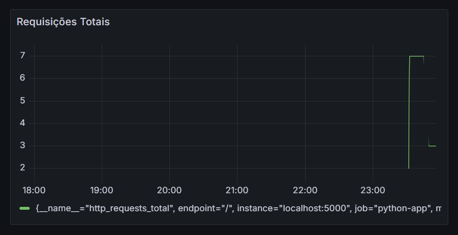

## Implementação de Métricas com Prometheus e Grafana em Python

Este repositório contém um guia para configurar uma aplicação Python que coleta métricas, integra com Prometheus para monitoramento e exibe gráficos no Grafana.

<hr>

### 📋 Requisitos

- Python 3.8+
- Prometheus
- Grafana
- Navegador para acessar dashboards

<hr>

### 🚀 Passo a Passo

#### 1. Configuração do Ambiente

1. Clone o repositório:
```cmd
git clone https://github.com/IsraelNLC/metrics-python
cd metrics-python
```

2. Ative a venv:
```cmd
venv\Scripts\activate  # ou source venv/bin/activate no Linux
```

3. Instale as dependências:
```cmd
pip install flask prometheus-client
```

<hr>

#### 2. Execute a API
1. Execute o comando: 
```cmd
python app.py
```

2. Acesse a API em:
- http://localhost:5000.

<hr>

#### 3. Configuração do Prometheus
1. Baixe o Prometheus:
    - Link do [download](https://prometheus.io/download/)

2. Configure o arquivo ``prometheus.yml``:

    Copie o arquivo [./src/prometheus.yml](./src/prometheus.yml) e cole na pasta raiz do Prometheus.

3. Inicie o Prometheus:

    Na pasta do prometheus, execute:
    ```cmd
    prometheus.exe --config.file=prometheus.yml
    ```

    Verifique no navegador: http://localhost:9090

<hr>

#### 4. Configuração do Grafana

1. Baixe e inicie o Grafana:
    - Link do [download](https://grafana.com/grafana/download)
    - Execute:
    ```cmd
    cd C:\Program Files\GrafanaLabs\grafana\bin # Troque pelo caminho da sua pasta do grafana
    grafana-server.exe
    ```

2. Acesse o painel:
    - Abra http://localhost:3000 no navegador.
    - Faça login com admin/admin (primeiro acesso).

3. Configurar o port (opcional):
    
    Caso ocorra algum erro, troque o port do arquivo ``grafana\conf\defaults.ini``:
    ```cmd
    http_port = 3100 # Exemplo de port que utilizei
    ```

4. Adicione o Prometheus como fonte de dados:
    - Vá para **Configuration > Data Sources**.
    - Selecione Prometheus e insira a URL: http://localhost:9090

5. Crie um dashboard:

Na seção de dashboards, crie um gráfico utilizando a métrica ``http_requests_total``.
O dashboard captura quantas vezes houveram requisições no endpoint ``http://localhost:5000`/``.

Exemplo: 